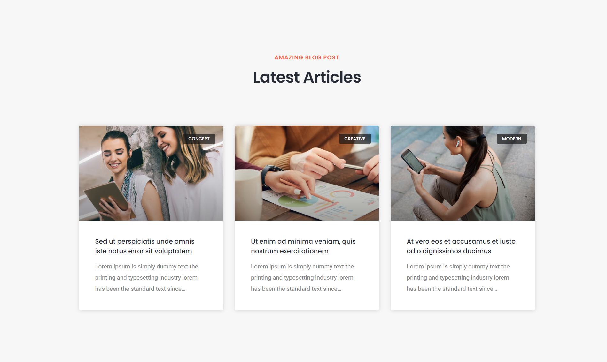

# WordPress Developer Exercise

&copy; 2021 Renderbit Technologies LLP.

## Prerequisites

1. You must be familiar with HTML/CSS, PHP, WordPress (including the use of the WordPress admin panel).
2. Proficiency with using theme/design frameworks (such as Elementor) will be additionally helpful.
3. Familiarity with custom plugin/theme development would be an added bonus.

## Getting Started

You would have to have a local WordPress development setup in place, with the following components (at least):

1. Web server (e.g, Apache)
2. DB server (e.g. MySQL)
3. PHP 7.4 or better
4. IDE/Editor (e.g. Visual Studio Code)

We recommend Laragon as a one-stop solution to get started with a local development environment (on Windows): [https://laragon.org/](https://laragon.org/)

## Problem Statement

You have to design the landing page for a corporate website using WordPress. A visual design of the landing page has been provided in the `mockups` folder. Download the mockups here: [GitHub](https://github.com/RenderbitTechnologies/WordPress-Developer-Exercise/archive/refs/heads/main.zip)

All the text and images on the website should be fully editable from the WordPress admin panel. We recommend that you use Custom Post Types in WordPress to implement some of the home page functionality (such as portfolio items). You can implement CPTs using a custom theme/plugin, or using an existing third-party plugin such as CPT UI: [https://wordpress.org/plugins/custom-post-type-ui/](https://wordpress.org/plugins/custom-post-type-ui/)

Note that the first section of the website is a full-width slider with 3 slides:

The slider images and content should be editable from the WordPress admin panel.

The header nav menu bar is shown as an overlay on top of the full-width slider for the first section. The header position then remains fixed at the top for all the other sections. The header nav menu should be editable from the WordPress admin panel.

The next section (about the company) contains a 2-column text layout, followed by 4 benefits (text & icons).

The benefit text & images should be editable from the WordPress admin panel.

The next section contains a 3-column grid of portfolio items.

The title, category & image for each portfolio item should be editable from the WordPress admin panel. New portfolio items should be able to be added as well.

The next section shows a timeline of awards of the company.

The year and title for awards should be editable from the WordPress admin panel.

The next section contains a description of services offered by the company in a 2-column layout.

The next section contains a grid of features in a 3-column layout.

The feature heading, subheading & icon should be editable for each feature from the WordPress admin panel.

The next section contains a 4-column list of customer logos.

Existing customer logos should be editable, as well as new customer logos should be able to be added from the WordPress admin panels.

The next section is a 3-column grid of team members.

Team members should be able to be added/updated from the WordPress admin panel.

The next section contains customer testimonials in a 3-column list.

The customer name, image & designation should be able to be updated for customer testimonials in the WordPress admin panel. New customer testimonials should be able to be added as well.

The next section contains a 4-column list of statistics.

The title and number for each statistic should be editable from the WordPress admin panel.

The next section shows blog posts in a 3-column layout. The category, title, featured image & excerpt is shown for each blog post.

The last section is the full-width footer.

The footer nav menus should be editable from the WordPress admin panel.

The social media links (both in header and footer) should be configurable from the WordPress admin panel.

## Resources

The fonts used in the design are as follows:

1. Headings: [Poppins](https://fonts.google.com/specimen/Poppins)
2. Body Text: [Roboto](https://fonts.google.com/specimen/Roboto)

Feel free to use font sizes as you think best as per the visual design.

The images & icons used in the visual design can be found folder-wise under the `resources` folder. You can download all the resources here: [GitHub](https://github.com/RenderbitTechnologies/WordPress-Developer-Exercise/archive/refs/heads/main.zip)

You can use any other free stock images in your design as you think best as per the visual design. You can find free stock images here: [https://unsplash.com/](https://unsplash.com/)

You can use Font Awesome icons for the social media icons used in the visual design: [https://fontawesome.com/](https://fontawesome.com/)

## Libraries & Frameworks

You are free to use any libraries, frameworks & tools which you think will be useful to build this website. No credits are deducted for use of libraries.

## Notes

1. You have to design the home page only.
2. You can design the website using a custom WordPress theme, or on top of any free existing WordPress theme.
3. Do not use a paid WordPress theme or nulled/cracked WordPress theme as your starting point for the website design.
4. You can use any free visual design/theme development framework (such as Elementor or Visual Composer) for the website design. However, do not use any paid visual design framework such as TagDiv Composer, WPBakery Page Builder or Elementor Pro for the starting point of your design.
5. Ensure that your design is mobile-responsive.

## Bonus Credits

1. Design other pages (About, Services, Portfolio, Team, Contact Us) using a similar design & visual aesthetic.
2. Design the custom post type details page (e.g. Portfolio Content - Single Post, Featured Works - Single Post).
3. Ensure that your design is SEO friendly.
4. Add animations and transitions.
5. Surprise us! 😀

## Submission

Please create a zip file of your local WordPress setup. Email us the WordPress zip file and SQL dump of your WordPress database to [careers@renderbit.com](mailto:careers@renderbit.com), mentioning your name and contact details. Alternatively, you can upload the WordPress files & database SQL export to GitHub/Google Drive and email us a link to the same. Please make sure to mention the WordPress admin username and password of the local WordPress setup which you are sharing with us.
